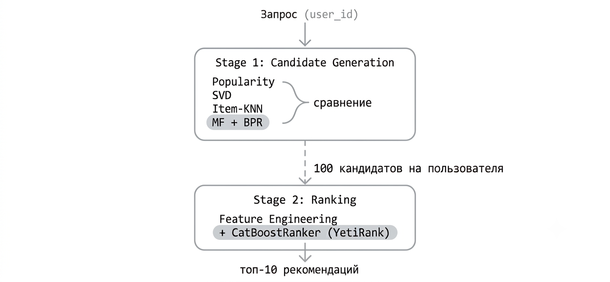
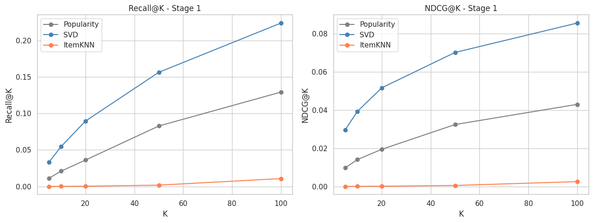
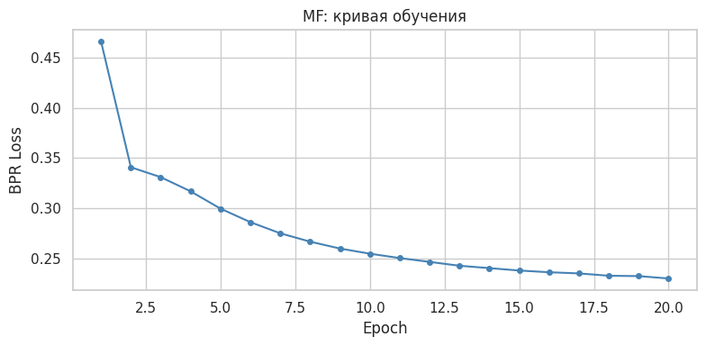
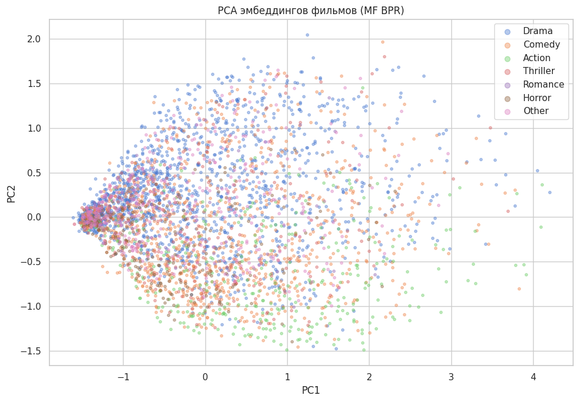
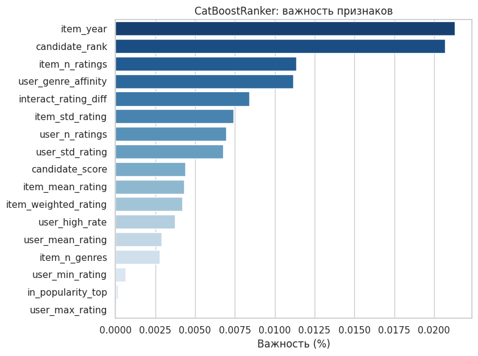
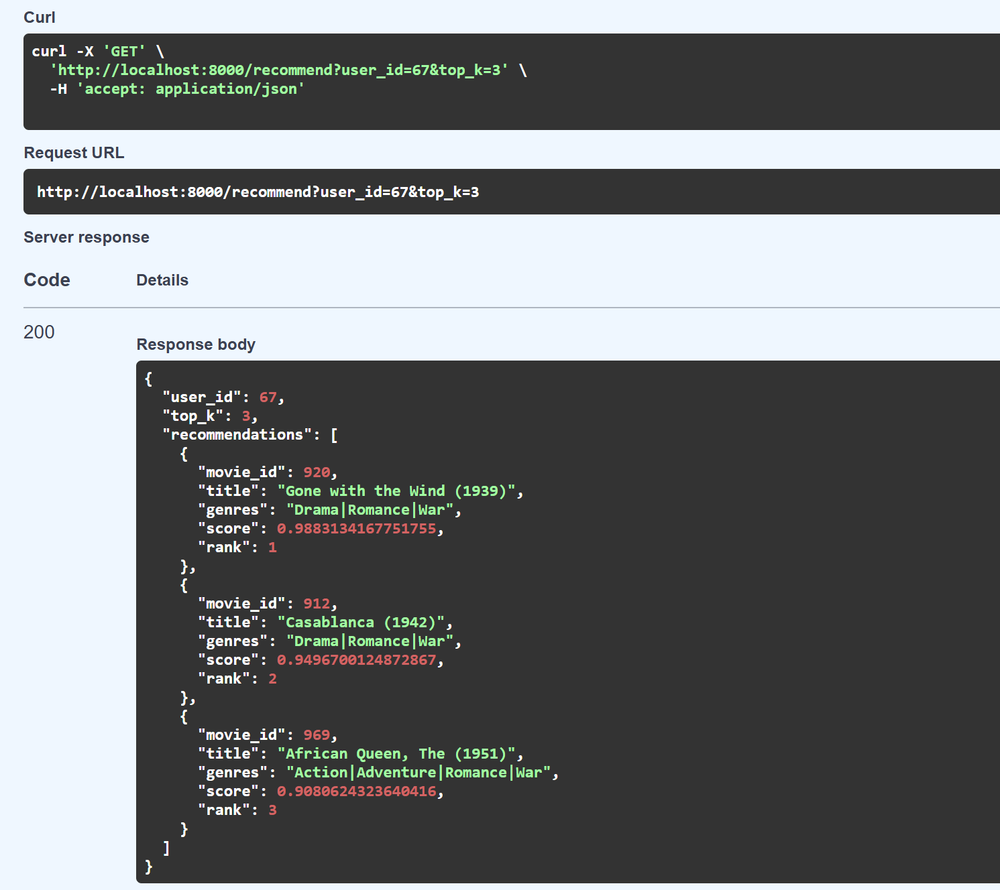

# Two-Stage RecSys на MovieLens 1M

Двустадийная рекомендательная система фильмов на датасете MovieLens 1M.

## Архитектура



## Датасет

[MovieLens 1M](https://grouplens.org/datasets/movielens/1m/)

| Параметр | Значение |
|---|---|
| Пользователей | 6 040 |
| Фильмов | 3 706 |
| Оценок | 1 000 209 |
| Разреженность | ~95.5% |
| Средний рейтинг | 3.58 |
| Медиана оценок на пользователя | 96 |
| Период | 2000-2003 |

Задача решается как implicit feedback: успехом считается любой факт просмотра (наличие оценки), отсутствие оценки интерпретируется как отсутствие взаимодействия. Датасет удобен тем, что у каждого пользователя минимум 20 оценок и проблема холодного старта отсутствует.

## Разбиение данных

Temporal split - сортировка по времени внутри каждого пользователя:

```
Train: 976 049 оценок (97.6%)
Val:    18 120 оценок  (1.8%)  <- 3 предпоследних фильма на пользователя
Test:    6 040 оценок  (0.6%)  <- 1 последний фильм на пользователя
```

Random split не используется: предсказываем будущее, а не случайные пропуски.

## Stage 1: Генерация кандидатов

Цель стадии — **Recall@100**: попасть релевантным фильмом в пул из 100 кандидатов. Recall@100 — верхняя граница качества всей системы.

| Модель | Recall@10 | Recall@50 | Recall@100 | NDCG@10 | Coverage@100 |
|---|---|---|---|---|---|
| Popularity | 0.021 | 0.083 | 0.129 | 0.014 | 0.146 |
| SVD (n=20) | 0.054 | 0.156 | 0.224 | 0.039 | 0.504 |
| Item-KNN | 0.000 | 0.002 | 0.011 | 0.000 | 0.782 |
| **MF + BPR (n=64)** | **0.059** | **0.200** | **0.318** | **0.043** | **0.502** |



Item-KNN показал низкий recall из-за высокой разреженности матрицы (~95.5%). Косинусное сходство между фильмами считается ненадёжно.

MF с BPR loss превзошёл SVD по всем метрикам: Recall@100 (0.318 vs 0.224), NDCG@10 (0.043 vs 0.039). Coverage при этом почти одинаковый (0.502 vs 0.504) — обе модели используют примерно половину каталога, но MF попадает в релевантные фильмы точнее. Преимущество BPR в том, что он оптимизирует попарное ранжирование (просмотренное > непросмотренного), а не MSE по известным оценкам.

### Кривая обучения MF



Loss резко падает до ~5-й эпохи, после 15-й выходит на плато — обучение остановлено на 15 эпохах.

### PCA эмбеддингов фильмов



Объяснённая дисперсия PCA: 60.2%. Жанры не образуют чётких кластеров. Модель группирует фильмы по поведению пользователей, а не по метаданным. Два фильма разных жанров могут оказаться рядом, если их смотрит одна аудитория.

## Stage 2: Ранжирование

CatBoostRanker (YetiRank) ранжирует 100 кандидатов -> топ-10.

### Признаки

| Группа | Признаки |
|---|---|
| Пользователь | кол-во оценок, средний рейтинг, std, доля высоких оценок |
| Айтем | кол-во оценок, средний рейтинг, std, взвешенный рейтинг (IMDb), год, кол-во жанров |
| Взаимодействие | разница средних рейтингов, жанровое сходство пользователя и фильма |
| Stage 1 | скор кандидата, ранг кандидата |

### Важность признаков



Год выпуска и ранг кандидата - наиболее важные признаки. `candidate_score` (сырой скор SVD) уступает `candidate_rank` — модель лучше использует относительный порядок, чем абсолютные значения.

### Финальные метрики

Ground truth = факт просмотра из val (3 фильма на пользователя).

| Модель | Precision@10 | Recall@10 | NDCG@10 | HitRate@10 | MRR@10 |
|---|---|---|---|---|---|
| Popularity (baseline) | 0.0063 | 0.0209 | 0.0140 | 0.0553 | 0.0188 |
| SVD-only (top-10) | 0.0163 | 0.0545 | 0.0392 | 0.1406 | 0.0550 |
| SVD + CatBoost | 0.0248 | 0.0826 | 0.0653 | 0.2071 | 0.0969 |
| MF only (top-10) | 0.0178 | 0.0594 | 0.0432 | 0.1551 | 0.0614 |
| **MF + CatBoost** | **0.0291** | **0.0970** | **0.0752** | **0.2452** | **0.1108** |

MF + CatBoost выбрана как основная система. HitRate@10 = 0.245 — у каждого четвёртого пользователя хотя бы один фильм из топ-10 совпал с реально просмотренным.

### Пример рекомендаций

Пользователь 43, в val смотрел: `Toy Story 2 (1999)`, `Thomas Crown Affair (1999)`, `X-Men (2000)`

| Ранг | Фильм | Жанры |
|---|---|---|
| 1 | American Beauty (1999) | Comedy, Drama |
| 2 | Toy Story 2 (1999) (попадание) | Animation, Children's, Comedy |
| 3 | Toy Story (1995) | Animation, Children's, Comedy |
| 4 | Bug's Life, A (1998) | Animation, Children's, Comedy |
| 5 | Ghostbusters (1984) | Comedy, Horror |

### API



## Структура репозитория

```
├── data/
│   └── ml-1m/               # сырые данные (скачать отдельно)
├── notebooks/
│   ├── 01_eda.ipynb         # EDA, temporal split
│   ├── 02_candidates.ipynb  # Stage 1: генерация кандидатов
│   ├── 03_ranking.ipynb     # Stage 2: CatBoostRanker
│   └── 04_mf_pytorch.ipynb  # MF на PyTorch + Stage 2
├── src/
│   ├── candidates.py        # PopularityRecommender, SVDRecommender, ItemKNNRecommender
│   ├── mf_model.py          # MatrixFactorization, BPRDataset, MFRecommender
│   ├── features.py          # feature engineering для ранкера
│   ├── ranker.py            # TwoStageRanker (CatBoostRanker)
│   └── metrics.py           # Precision, Recall, NDCG, HitRate, MRR
├── api/
│   └── main.py              # FastAPI сервис
├── models/                  # обученные модели (.pkl) (не в git)
├── Dockerfile
├── docker-compose.yml
├── requirements.txt
└── requirements-docker.txt
```

## Быстрый старт

**1. Данные**

Скачайте [MovieLens 1M](https://grouplens.org/datasets/movielens/1m/) и распакуйте в `data/ml-1m/`.

**2. Установка зависимостей**

```bash
pip install -r requirements.txt
```

**3. Обучение моделей**

```bash
jupyter notebook notebooks/01_eda.ipynb
jupyter notebook notebooks/02_candidates.ipynb
jupyter notebook notebooks/03_ranking.ipynb
jupyter notebook notebooks/04_mf_pytorch.ipynb
```

**4. Запуск API**

Локально:
```bash
uvicorn api.main:app --reload --port 8000
```

Через Docker:
```bash
docker-compose up --build
```

**5. Пример запроса**

```bash
curl "http://localhost:8000/recommend?user_id=1&top_k=10"
```

Swagger UI: `http://localhost:8000/docs`

## Стек

Python, Pandas, NumPy, scikit-learn, PyTorch, CatBoost, FastAPI, Docker
